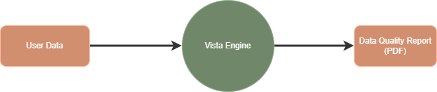

# VISTA: Verify Integrity and Statistics for Tabular Analytics

## Overview


VISTA is a Python-based tool for automated data quality profiling and reporting. It analyzes tabular datasets (CSV, Parquet, JSON) and generates a comprehensive PDF report with metrics, insights, and visualizations.

## Workflow


## Features (v1)
- Fast data profiling using [Polars](https://www.pola.rs/)
- Generates PDF reports with [ReportLab](https://www.reportlab.com/)
- Supports CSV, Parquet, and JSON files
- Metrics include missing values, duplicates, cardinality, numeric/text stats, outlier analysis, and value counts
- Sample data preview

### Future Expansion (v1.1)
- Generate statistical visualizations for numeric data.
- Add more metrics such as: data freshness, cardinality, entropy and correlation metrics.
- Shows data quality score across the data.
- Make it as a versatile eda tool and monitoring tool

## Installation

1. Clone the repository:
   ```bash
   git clone <repo-url>
   cd vista
   ```
2. Create and activate a Python virtual environment:
   ```bash
   python3 -m venv env
   source env/bin/activate
   ```
3. Install dependencies:
   ```bash
   pip install -e .
   ```

## Usage

Run the CLI to generate a report:
```bash
vista --file_path <path/to/data.csv> --file_type csv --output_path vista_report.pdf
```
- `--file_path`: Path to your data file (CSV, Parquet, JSON)
- `--file_type`: File type (`csv`, `parquet`, `json`)
- `--output_path`: Output PDF path (default: `vista_report.pdf`)

## Example
```bash
vista --file_path data/movies_dataset.csv --file_type csv --output_path movies_report.pdf
```

## Project Structure
```
src/vista/
  main.py            # CLI entry point
  core/metrics.py    # Data profiling logic
  io/file_reader.py  # Data loading
  io/report_generator.py # PDF report generation
```

## Dependencies
- polars
- jinja2
- pdfkit
- reportlab

## Author
Navaneethan Ghanti
